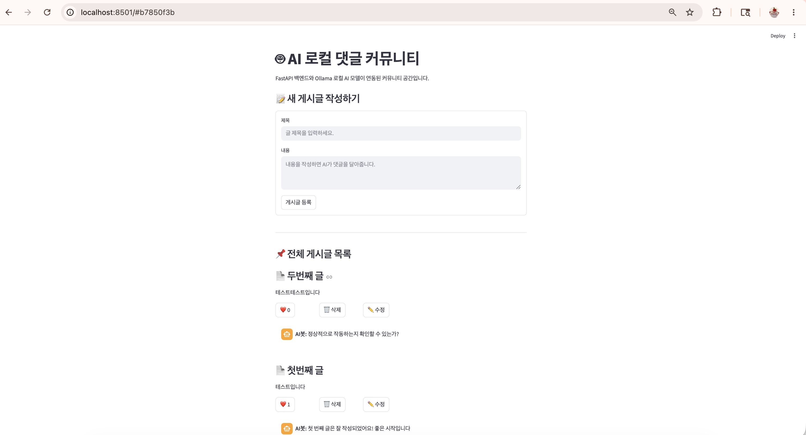
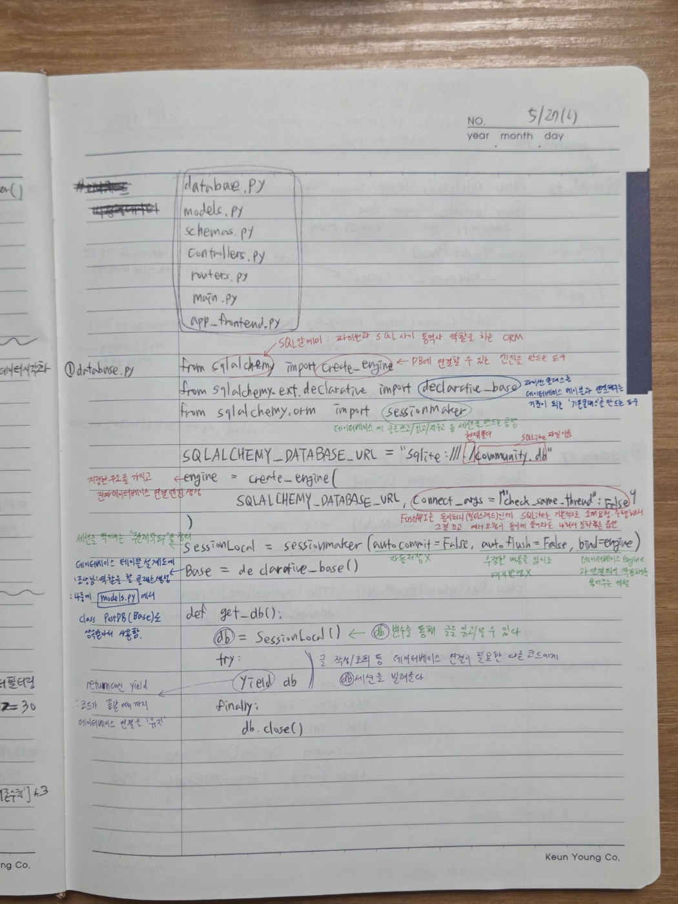
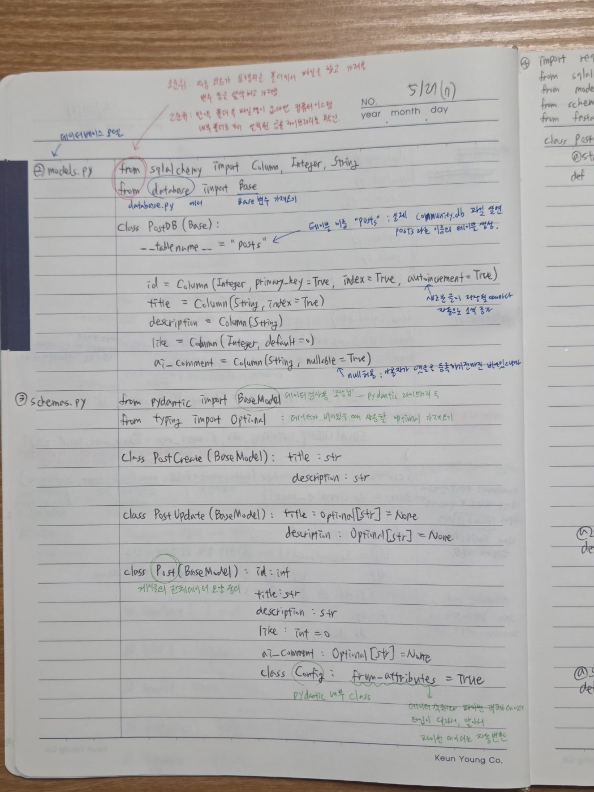
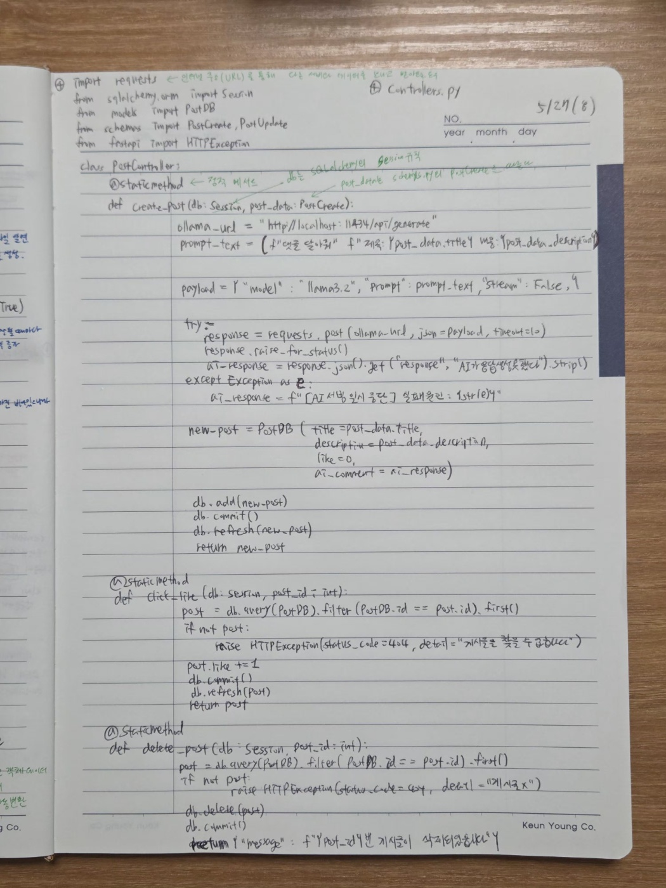

gemini 대화 기록 : https://share.google/aimode/vURAGZG1Ov0MaYGLo

# 파일 구조
```text
📁 week2_ai/
├── 📄 database.py      # DB 연결 및 세션 설정
├── 📄 models.py        # SQLAlchemy DB 모델 (Model)
├── 📄 schemas.py       # Pydantic 데이터 검증 양식
├── 📄 controllers.py   # AI 호출 및 실제 비즈니스 로직 (Controller)
├── 📄 routers.py       # API 경로 정의 (Route)
├── 📄 main.py          # FastAPI 앱 실행 진입점
└── 📄 app_frontend.py
```
<br>
<br>

# 설명
기본적으로 

1. 전체조회
2. 게시글 등록
3. 게시글 좋아요
4. 게시글 삭제
5. 게시글 수정
  
을 한 파일에 작성한 뒤, ai에게 코드를 주고 
<br>
<br>


* AI 모델 서빙 -- ollama llama3.2
* 데이터베이스 적용하기 - -sqlite
* 구조 개선하기(예: Route - Controller - Model 패턴을 적용)
* (선택) HTML/CSS/나 스트림릿으로 프론트엔드 만들기

를 맡겼다.

<br>

실행화면은 아래와 같다.


<br>
<br>

# 회고
(26.05.24) <br>
아직 터미널도 익숙하지 않아서 하나하나 검색하며 따라가고 있다...<br>
과제를 제출 후, 하나씩 코드를 뜯어보며 공부할 예정이다.  <br>
<br>
(26.05.27) <br>
이번 주는 데이터분석/데이터시각화를 하면서 시간이 조금 남았다.<br>
코드를 하나하나 살펴보면서 왜 이렇게 구성이 되었는지, 각 함수나 인자들이 어디서 호출이 되면 어떻게 가는지를 손으로 코딩하며 살펴보았다.<br>

  

<br>
(26.05.28) <br>
다른 사람들이 제출한 과제를 살펴봤다. <br>
다들 너무 잘 작성한 것 같다.. 나는 동일한 시간동안 왜 스스로 하지 못하였나 조금은 자책감도 들었다<br>
내가 그 시간동안 놀았나? 그건 아닌데.. 시간이 된다면 fastapi 과제는 쇼핑몰 만들기 등으로 다시 한 번 해보고 싶다 -- 시간이 있을까 


