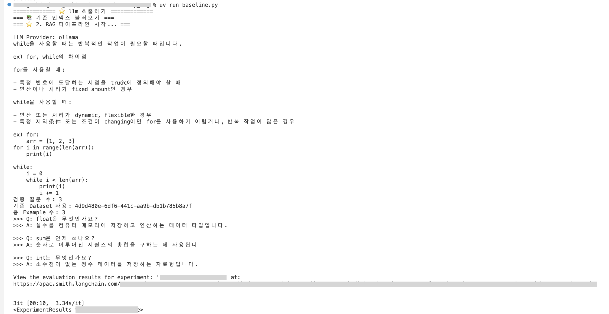
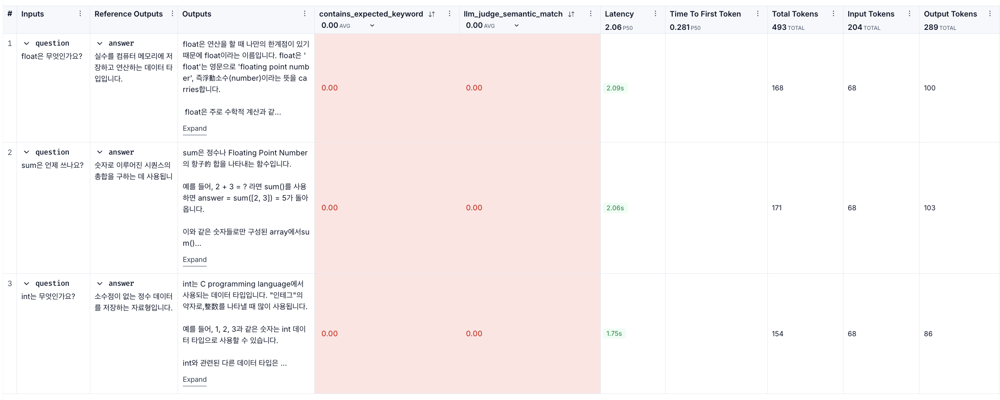

# 과제 설명
[원본] https://github.com/100-hours-a-week/alex-rag 를 pull해서 그대로 따라해보기  

<br>
  

## v1에서 변경된 사항
### 1. chroma db로 인덱싱은 1번만 진행하기 
*  인덱싱은 원래 llm을 호출할 때 1번 진행되어야하는 사항이지만, 현재 코드에서는 메모리(RAM)에만 벡터를 저장하고 있어 호출할 때마다 새롭게 인덱싱이 진행되던 상황이었다. 이로 인해, 인덱싱을 할 때마다 Google 임베딩 API를 호출하여 시간과 비용이 더 들고 있었다.  
*  저장 폴더를 지정하여 디스크에 데이터를 남긴다. 그리고 이미 있으면 불러오고, 없으면 새로 만들기를 코드에서 추가한다. (rag_chain.py의 build_rag_chain 함수 변경)
*  또한, 벡터 DB는 로컬 환경마다 다시 생성해야하고, 용량이 크며 바이너리 파일이라 gitignore로 넣어놓는다.
*  만약, db 내용이 바뀌었다면 삭제하고 실행해야 한다.
```
rm -rf chroma_db        # chromadb 삭제
uv run baseline.py      # 실행
```

### 2. ollama 로 실행과 판단 모델 변경 (선택사항)
*  gemini-2.5-flash로 진행하던 중 api 최대한도로 인해 429 에러 발생.
*  평가 질문이 3개 이므로, judge 진행 시 rag 호출 3번 + llm_judge 3번 = 최소 6번 이상 호출되기 때문.
*  .env와 rag_chain.py에서 ollama로 변경. (gemini 호출을 우선으로 하고, 한도가 막힐 시 ollama로 진행하려 했지만 그것만으로도 1번 호출을 사용하는거기 때문에 아예 변경. 대신 주석으로 처리해뒀다.)
*  즉, llm과 judge_llm은 별도 분리하지 않고 둘 다 ollama(llama3.2)를 사용. (본인이 본인을 판단, v3에서 분리 예정)
*  추가로, llama3.2 모델은 임베딩을 지원하지 않아서 rag_chain.py에서 임베딩 시 nomic-embed-text 를 미리 설치하고 사용.
*  정리
    *  LLM (llama3.2) -> 질문에 답변 생성하는 역할
    *  임베딩 (nomic-embed-text) -> 문서를 벡터로 변환해서 Chroma에 저장하는 역할
```
ollama pull nomic-embed-text
uv run baseline.py
```




*  문제 : 평가가 모두 0으로 나오는 상황