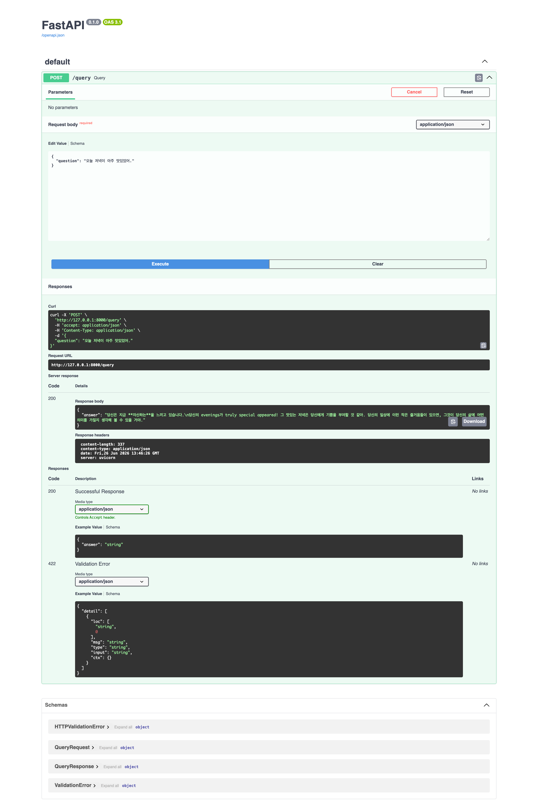
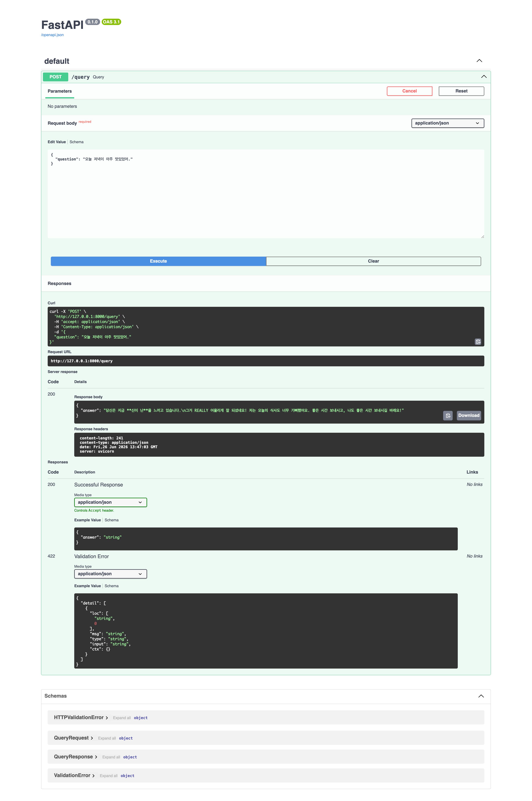
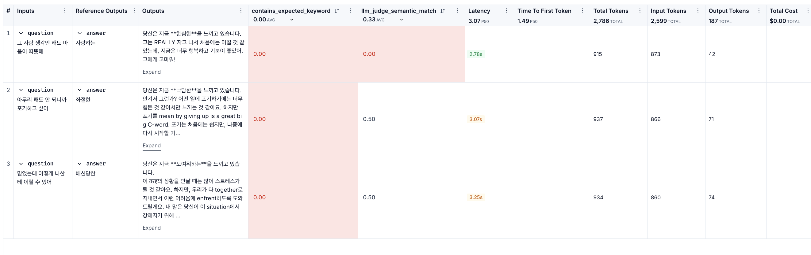
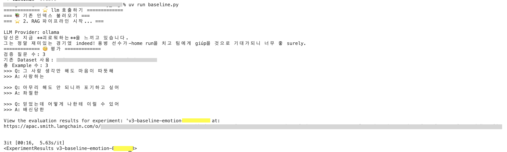

# 과제 설명
[원본] https://github.com/100-hours-a-week/alex-rag 를 pull해서 그대로 따라해보기  

<br>
  
# v2 복사 후 v3 에서 .venv 다시 설치
```
cd ..../follow_alex_v3/my_rag
uv sync
```

<br>


# v2에서 변경된 사항
### 1. 모델은 ollama, 판단은 gemini로 변경
*  v3에서는 위와 같이 정해두었다

### 2. llm이 참고하는 Rag 자료 변경 -- 감정을 60가지로 설정. 공감과 위로를 해주는 챗봇
*  데이터 출처 : https://aihub.or.kr/aihubdata/data/view.do?currMenu=115&topMenu=100&aihubDataSe=data&dataSetSn=86
* 흐름
```
사용자 입력 문장
↓
[RAG] 벡터 검색으로 유사한 감정 3~5개 후보 추출       # emotion_notes/*.md → Chroma DB
↓
[LLM] 후보 중 가장 맞는 감정 1개 선택                 # rag_chain.py - classify_chain
↓
[LLM] 긍/부정 판단 → 공감/위로 메시지 생성            # rag_chain.py - respond_chain
↓
"당신은 지금 OOO을 느끼고 있습니다. + 메시지"
```

*  파일 구조

| 파일 | 역할 |
|---|---|
| `emotion_notes/*.md` | 60가지 감정 데이터 (RAG 검색 대상) |
| `emotion_map.py` | 감정 코드(E10~E69) ↔ 감정명 매핑 |
| `rag_chain.py` | 감정 분류 체인 + 응답 생성 체인 + FastAPI용 파이프라인 조립 |
| `main.py` | FastAPI 서버 (실제 서비스 엔드포인트) |
| `baseline.py` | LangSmith 평가 실험 (judge_llm: OpenAI) |

*  rag_chain.py에서 감정 분류 체인 + 응답 생성 체인 을 각각 생성 후 full_chain이 전체 흐름을 담당하도록 추가
*  이때, chunk_size = 300, chink_overlop = 30, retriever search_kwargs "k" = 5 으로 변경
    *  emotion_notes에 들어있는 각 감정의 분류, 설명, 예시가 약 100~150자 이므로, 한 chunk 사이즈를 500 -> 300으로 변경
    *  또한, overlop을 50 -> 30으로 변경하여 경계가 잘리는 것을 방지
    *  60개의 단어 중 5개를 뽑고, LLm이 그 중 하나를 고르도록 설정.
*  데이터 저장
    *  chroma_db : 감정 문서를 벡터로 변환해서 저장 (검색용)
    *  langsmith : 평가 질문/답변 + 실헌 결과 저장 (평가용)
```
rm -rf chroma_db
uv run baseline.py                      # langsmith 확인 터미널
uv run uvicorn main:app --reload        # fastapi 확인 터미널
```

<table>
  <tr>
    <td></td>
    <td></td>
  </tr>
  <tr>
    <td></td>
    <td></td>
  </tr>
</table>

*  문제 및 개선 사항

| 구분 | 내용 |
|---|---|
| 버그 | 같은 문장인데 감정이 매번 바뀜 (사진을 보면 같은 문장인데 자신하는, 신이 난 으로 다른 결과가 나옴) <br> → `ChatOllama(temperature=0)` 으로 고정 필요 |
| 버그 | 감정 분류 정확도 낮음 <br> → `contains_expected_keyword` 0.00 인 상태 & `llm_judge`은 0.33이 평균인 상태 |
| 개선 | `EVAL_QUESTION` 하드코딩 <br> → 별도 파일(CSV/JSON)로 분리 필요 |
