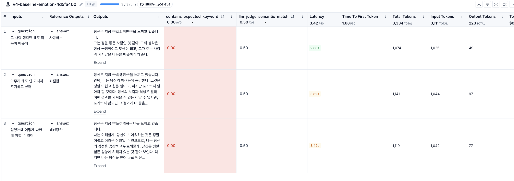
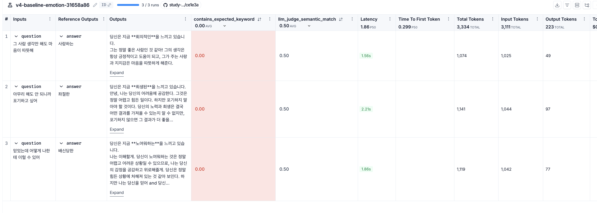
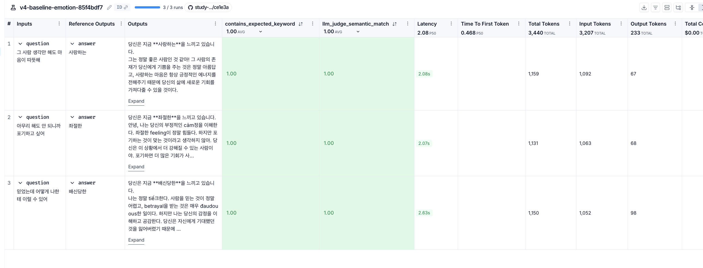

# 과제 설명
[원본] https://github.com/100-hours-a-week/alex-rag 를 pull해서 그대로 따라해보기  

<br>
  
# v3 복사 하기
```
rsync -av --exclude='.venv' --exclude='chroma_db' --exclude='__pycache__' --exclude='.env' \
  /Users/.../week7/follow_alex_v3/ \
  /Users/.../week7/follow_alex_v4/
```

<br>

# v3에서 복사 후 v4 에서 .venv 다시 설치
```
cd ..../follow_alex_v4/my_rag
uv sync
```

<br>


# v3에서 변경된 사항
### 1. v3에서 발견한 버그 2개 수정
*  버그1 : 같은 문장을 입력해도 감정이 매번 바뀌는 문제
    *  원인 : `ChatOllama`의 기본 temperature가 0.8로 설정되어 있어 매번 다른 결과가 나옴
    *  해결 : rag_chain.py에서 `ChatOllama(temperature=0)` 으로 고정
*  버그2 : llm이 감정 코드(`E60`) 대신 ollama가 판단한 감정을 뽑고, 매칭을 하지 못해 "감정을 추출하지 못했다"는 조건으로 들어가버려서, 해당 텍스트를 그대로 출력하는 문제
    *  원인 : 프롬프트 지시가 약해서 llama3.2가 지시를 무시함
    *  해결 : rag_chain.py에서 `classify_prompt` 강화 — 출력 형식 예시(`예시 출력: E60`) 추가

### 2. 감정 분류 정확도 개선
*  각 감정당 예시 1개 → 5개로 늘려 RAG 검색 정확도 향상
*  임베딩 모델 교체 : `nomic-embed-text` → `bge-m3`
    *  원인 : `nomic-embed-text`가 한국어 의미 유사도를 제대로 파악하지 못함
    *  예) "마음이 따뜻해" → 사랑하는(E62) 대신 혐오스러운(E57), 회의적인(E36)을 검색해옴
    *  `bge-m3`는 다국어(한국어 포함) 임베딩 모델로 한국어 성능이 개선됨
*  chunk_size 300 → 500, k 5 → 7 로 변경
    *  예시가 5개로 늘어나면서 한 감정당 텍스트가 길어져 chunk_size를 늘림
    *  더 많은 후보를 검색하기 위해 k를 늘림


# 평가 기록
<table>
  <tr>
    <td></td>
    <td></td>
    <td></td>
  </tr>
</table>

| 실험 | 변경 사항 | contains_keyword | llm_judge | Latency |
|---|---|---|---|---|
| v4-baseline-emotion-4d5fa400 | v3 chroma_db 그대로 <br>(예시 미반영, nomic-embed-text) | 0.00 | 0.50 | 3.73s |
| v4-baseline-emotion-31658a86 | 예시 5개 추가 | 0.00 | 0.50 | 1.88s |
| v4-baseline-emotion-85f4bdf7 | bge-m3 교체 + chroma_db 재인덱싱 | 1.00 | 1.00 | 2.26s |
| v4-baseline-emotion-85f4bdf7 이후 | chunk_size, k 변경 (미실행) | - | - | - |

