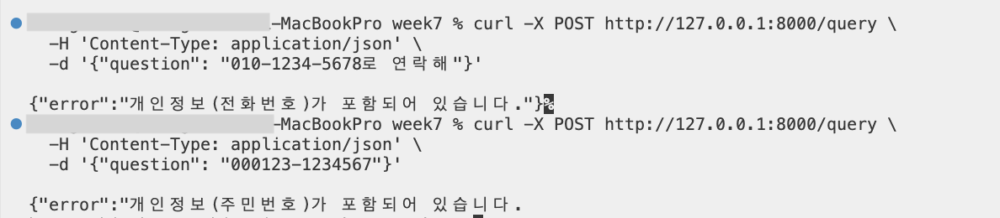
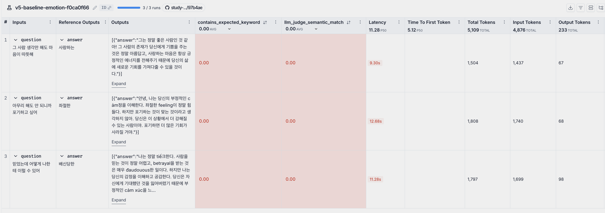
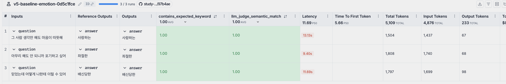

# 과제 설명
[원본] https://github.com/100-hours-a-week/alex-rag 를 pull해서 그대로 따라해보기  

<br>
  
# v4 복사 하기
```
rsync -av --exclude='.venv' --exclude='chroma_db' --exclude='__pycache__' --exclude='.env' \
  /Users/.../week7/follow_alex_v4/ \
  /Users/.../week7/follow_alex_v5/
```

<br>

# v4에서 복사 후 v5 에서 .venv 다시 설치
```
cd ..../follow_alex_v5/my_rag
uv sync
```

<br>


# v4에서 v5로 변경된 사항
### 1. structured output 구조 (pydantic)으로 변경
*  `rag_chain.py`에 `EmotionResult` Pydantic 모델 추가
*  `full_chain()`이 문자열 대신 `EmotionResult` 객체를 반환하도록 변경
*  `main.py`의 `QueryResponse`도 Pydantic 모델로 통일, `response_model`로 응답 형식 명시
*  기존 v4의 단순 문자열 응답 → `emotion_code`, `emotion_name`, `valence`, `message` 4개 필드로 구조화


### 2. middleware - 개인정보 탐지 (main.py)
*  `PIIFilterMiddleware` — `BaseHTTPMiddleware`를 상속해 요청 body를 가로채 정규식으로 PII 탐지
*  탐지 패턴: 전화번호 (`\d{3}-\d{3,4}-\d{4}`), 이메일, 주민번호
*  PII 감지 시 chain 실행 전에 400 에러 반환
*  터미널에서 서버를 키고 테스트 해보기


```
# 서버키기
cd /Users/.../follow_alex_v5/my_rag
uv run uvicorn main:app --reload

# 다른 터미널에서 테스트해보기 (main.py에서 코드 수정)
%...-ui-MacBookPro week7 % curl -X POST http://127.0.0.1:8000/query \
  -H 'Content-Type: application/json' \
  -d '{"question": "010-1234-5678로 연락해"}'

>>> {"error":"개인정보(전화번호)가 포함되어 있습니다."}

%...-ui-MacBookPro week7 % curl -X POST http://127.0.0.1:8000/query \
  -H 'Content-Type: application/json' \
  -d '{"question": "000123-1234567"}'        

>>> {"error":"개인정보(주민번호)가 포함되어 있습니다."}

```

### 3. batch - 평가 질문 병렬 처리 (baseline.py)
*  처음 시도 : `target()`을 `list[dict]`를 받아 `rag.batch()`로 여러 질문을 한번에 처리하도록 변경
    *  에러 : `TypeError: string indices must be integers, not 'str'`
    *  원인 : LangSmith `evaluate()`는 `target()`을 example **하나씩** 호출함. `inputs`가 `list`가 아니라 `dict` 하나(`{"question": "..."}`)로 들어오는데, `for inp in inputs`를 하면 `inp`가 딕셔너리의 키인 `"question"` 문자열이 되어버려 에러 발생
*  1차 수정 : `target()`을 단일 `dict`를 받는 원래 형태로 되돌리고, `rag.invoke()` 호출 후 `result.message` 반환
    *  결과 : 실행은 됐으나 `contains_expected_keyword`, `llm_judge` 모두 **0.00** — `message`는 공감 응답 문장이라 감정명 키워드가 없어서 매칭 실패
*  2차 수정 : `result.message` → `result.emotion_name` 으로 변경
    *  이유 : 평가 기준이 "감정 분류가 맞는가"이므로, 감정명만 반환하는 것이 평가 의도에 맞음
    *  결과 : `contains_expected_keyword` **1.00**, `llm_judge` **1.00** 달성
*  `evaluate(max_concurrency=3)`으로 LangSmith가 내부적으로 병렬 처리를 담당
*  `rag.batch()`는 LangSmith 밖에서 직접 여러 질문을 한번에 처리할 때 사용하는 것

<table>
  <tr>
    <td></td>
    <td></td>
  </tr>
</table>

| 차수 | 실험 | 수정 내용 | contains_keyword | llm_judge |
|---|---|---|---|---|
| 1차 | v5-baseline-emotion-f0ca0f66 | `target()` 시그니처 오류 수정 (`list` → `dict`) + `result.message` 반환 | 0.00 | 0.00 |
| 2차 | v5-baseline-emotion-0d5c1fce | `result.emotion_name` 반환으로 변경 | 1.00 | 1.00 |


