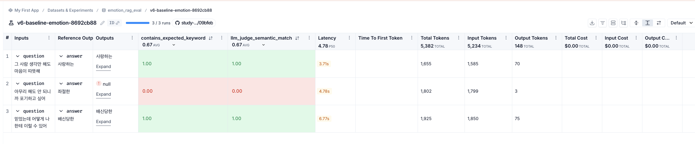
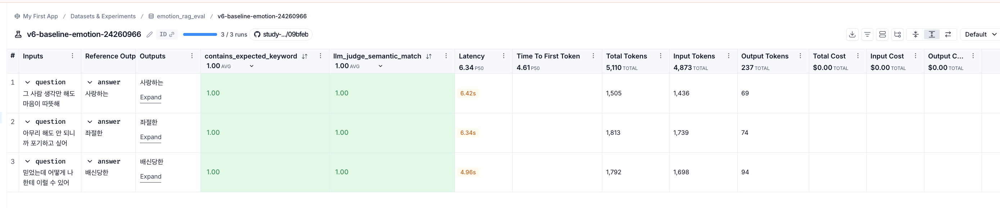
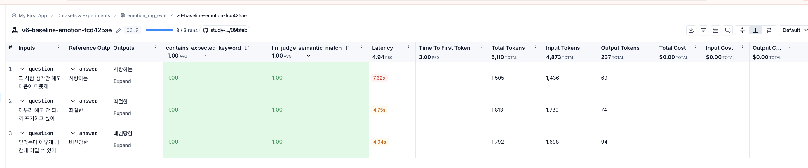
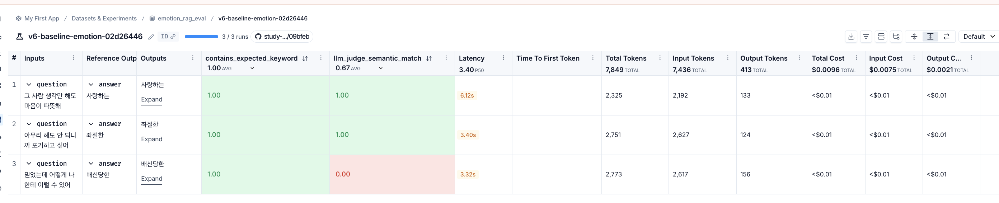
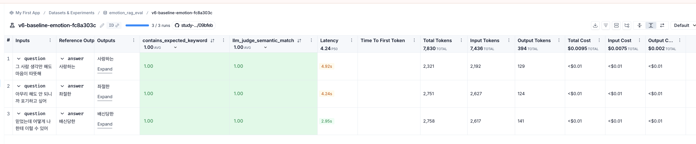

# 과제 설명
[원본] https://github.com/100-hours-a-week/alex-rag 를 pull해서 그대로 따라해보기

<br>

# v5 복사 하기
```
rsync -av --exclude='.venv' --exclude='chroma_db' --exclude='__pycache__' --exclude='.env' \
  /Users/.../week7/follow_alex_v5/ \
  /Users/.../week8/follow_alex_v6/
```

<br>

# v5에서 복사 후 v6에서 .venv 다시 설치
```
cd ..../follow_alex_v6/my_rag
uv sync
```

> 주의: `uv sync` 후 별도로 `uv add langchain-anthropic` 필요
> (미설치 시 Claude fallback 실패 → Judge LLM이 OpenAI로 넘어감)

<br>

# v5에서 v6으로 변경된 사항
### 1. LLM 다중 제공자 fallback 전략 (rag_chain.py)
* `build_llm()` 함수를 신설해 LLM 선택 로직을 체인 밖으로 분리
* 우선순위: **NVIDIA NIM → Claude (Anthropic) → Ollama** 순으로 순차 시도
* 각 단계에서 `llm.invoke("ping")`으로 연결 검증 후, 실패 시 다음 제공자로 자동 전환
* `.env`에서 `NVIDIA_API_KEY`, `ANTHROPIC_API_KEY` 유무로 사용 가능한 LLM 자동 감지

### 2. Judge LLM 분리 (baseline.py)
* `build_judge_llm()` 함수를 추가해 RAG용 LLM과 평가용 LLM을 독립적으로 구성
* Judge LLM은 **Claude → Ollama** 순으로 fallback (NVIDIA 제외)

### 3. max_concurrency: 3 → 1로 변경 (baseline.py)
* `max_concurrency`는 LangSmith `evaluate()`가 `target()` 함수를 동시에 몇 개까지 병렬 호출할지 제어하는 값
* v5에서는 3으로 설정해 3개 질문을 동시에 처리했지만, NVIDIA NIM의 무료 API 사용 한도(rate limit)를 초과해 `429 Too Many Requests` 에러 발생
* 1로 낮춰 질문을 순차적으로 하나씩 처리함으로써 rate limit 방어

<br>

# 실행 결과

### 1차 실행 — v6-baseline-emotion-8692cb88
```
RAG LLM  : NVIDIA NIM (deepseek-ai/deepseek-v4-pro)
Judge LLM: OpenAI (gpt-4o-mini)   ← langchain_anthropic 미설치로 Claude 실패
```
* 문서 인덱싱 신규 생성 (6개 문서, 47개 chunk)
* 2번 질문("아무리 해도 안 되니까 포기하고 싶어") → `null` 출력, 429 에러로 RAG 체인 실패
* `langchain_anthropic` 패키지가 없어서 Judge가 OpenAI로 fallback됨



**→ 원인 파악 후 `uv add langchain-anthropic` 으로 패키지 설치**

```bash
uv add langchain-anthropic
# anthropic==0.113.0, langchain-anthropic==1.4.8 설치됨
```

---

### 2차 실행 — v6-baseline-emotion-24260966
```
RAG LLM  : Ollama (llama3.2)   ← NVIDIA 429로 fallback
Judge LLM: Claude (claude-haiku-4-5-20251001)
```
* 3개 질문 모두 정상 응답, 전 항목 1.00 달성



---

### 3차 실행 — v6-baseline-emotion-fcd425ae
```
RAG LLM  : Ollama (llama3.2)
Judge LLM: Claude (claude-haiku-4-5-20251001)
```
* 2차와 동일 환경 재실행, 결과도 동일하게 1.00



---

### 4차 실행 — v6-baseline-emotion-02d26446
```
RAG LLM  : Claude (claude-haiku-4-5-20251001)
Judge LLM: Ollama (llama3.2)   ← NVIDIA 429로 fallback
```
* 3번 질문("믿었는데 어떻게 나한테 이럴 수 있어") → llm_judge `0.00`
* Judge가 Ollama(llama3.2)로 돌아가면서 "배신당한" 의미 매칭을 제대로 못 함
* **Judge LLM 품질이 평가 결과에 직접 영향을 준다는 것을 확인**



---

### 5차 실행 — v6-baseline-emotion-fc8a303c
```
RAG LLM  : Claude (claude-haiku-4-5-20251001)
Judge LLM: Claude (claude-haiku-4-5-20251001)
```
* RAG LLM과 Judge LLM 모두 Claude, 전 항목 1.00 달성



---

### 실행 결과 요약

| 차수 | 실험 ID | RAG LLM | Judge LLM | contains_keyword | llm_judge | 특이사항 |
|---|---|---|---|---|---|---|
| 1차 | v6-baseline-emotion-8692cb88 | NVIDIA NIM | OpenAI | 0.67 | 0.67 | 429 에러로 2번 null, langchain_anthropic 미설치 |
| 2차 | v6-baseline-emotion-24260966 | Ollama | Claude | 1.00 | 1.00 | langchain_anthropic 설치 후 재실행 |
| 3차 | v6-baseline-emotion-fcd425ae | Ollama | Claude | 1.00 | 1.00 | 동일 환경 재실행, 결과 동일 |
| 4차 | v6-baseline-emotion-02d26446 | Claude | Ollama | 1.00 | 0.67 | Ollama Judge가 의미 매칭 실패 |
| 5차 | v6-baseline-emotion-fc8a303c | Claude | Claude | 1.00 | 1.00 | 둘 다 Claude, 안정적 1.00 |
