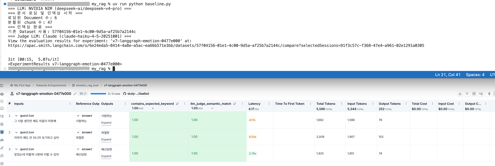

# 과제 설명
[원본] https://github.com/100-hours-a-week/alex-rag 를 pull해서 그대로 따라해보기

<br>

# v6에서 v7로: 변경 방식
rsync 복사 없이 직접 파일을 작성함
- `emotion_map.py` 만 복사, 나머지는 새로 타이핑
- v6(LCEL) → v7(LangGraph) 로 구조 전환

<br>

# v6 구조 (LangChain LCEL)
```
┌─────────────────────────────────────────────────────────┐
│                      main.py (FastAPI)                  │
│                                                         │
│  Request ──→ PIIFilterMiddleware ──→ /query endpoint    │
└──────────────────────────┬──────────────────────────────┘
                           │ rag.invoke(question)
                           ▼
┌─────────────────────────────────────────────────────────┐
│                  rag_chain.py (LCEL 파이프라인)          │
│                                                         │
│  user_input                                             │
│      │                                                  │
│      ▼                                                  │
│  ┌─────────────┐                                        │
│  │ classify_chain (LCEL)                                │
│  │   Chroma retriever (k=7)                             │
│  │      ↓                                               │
│  │   classify_prompt                                    │
│  │      ↓                                               │
│  │   LLM (NVIDIA → Claude → Ollama)                    │
│  │      ↓                                               │
│  │   StrOutputParser → raw (e.g. "E60")                │
│  └──────┬──────┘                                        │
│         │ regex 추출 + EMO_MAP 조회                     │
│         ▼                                               │
│  ┌─────────────┐                                        │
│  │ respond_chain (LCEL)                                 │
│  │   respond_prompt (emotion + valence + question)      │
│  │      ↓                                               │
│  │   LLM                                                │
│  │      ↓                                               │
│  │   StrOutputParser → message                          │
│  └──────┬──────┘                                        │
│         │                                               │
│         ▼                                               │
│   EmotionResult (Pydantic)                              │
└─────────────────────────────────────────────────────────┘

┌─────────────────────────────────────────────────────────┐
│                  baseline.py (평가)                      │
│                                                         │
│  rag.invoke() ──→ target()                              │
│                      │                                  │
│               evaluate() (LangSmith)                   │
│                 ├── contains_expected_keyword           │
│                 └── llm_judge (Claude → Ollama)         │
└─────────────────────────────────────────────────────────┘
```

<br>


# v7 구조 (LangGraph)

### v6 vs v7 개념 비교
| | v6 (LCEL) | v7 (LangGraph) |
|---|---|---|
| 흐름 표현 | 파이프 `\|` 체인 | 노드 + 엣지 그래프 |
| 상태 관리 | 없음 (함수 로컬 변수) | `TypedDict` State 객체 |
| 분기 | if/else Python 코드 | 조건부 엣지 |
| 디버깅 | 어려움 | LangSmith에서 노드별 시각화 |

### 파일 구조 변화
| 파일 | v6 → v7 |
|---|---|
| `emotion_map.py` | 손댈 것 없음 |
| `rag_chain.py` | → `state.py` + `nodes.py` + `graph.py` 로 분리 |
| `main.py` | `build_rag_chain()` → `build_graph()` 로 교체 |
| `baseline.py` | `build_llm()` 제거, `build_judge_llm()` 만 유지 |


### 왜 v7에서 LangGraph가 유리한가?
*  에러 분기를 명시적으로 표현 — full_chain() 안의 raise ValueError가 조건부 엣지로 분리됨
*  중간 상태 추적 — LangSmith에서 노드별로 context, raw_code, emotion_code가 단계별로 보임
*  확장성 — 나중에 "재시도 노드", "Human-in-the-loop 노드" 추가가 쉬움
*  State가 명시적 — 지금은 full_chain() 함수 로컬 변수로 흩어진 code, emotion, valence가 하나의 TypedDict로 모임


### v7 구조 다이어그램
```python
State = {
    "question": str,
    "context": list[Document],    # 검색 결과
    "raw_code": str,             # LLM 분류 출력
    "emotion_code": str,
    "emotion_name": str,
    "valence": str,
    "message": str,
    "error": str | None,
}
```

```
         ┌──────────┐
         │  START   │
         └────┬─────┘
              │
              ▼
    ┌──────────────────┐
    │  retrieve_node   │  Chroma에서 문서 k=7 검색
    │  state.context   │
    └────────┬─────────┘
             │
             ▼
    ┌──────────────────┐
    │  classify_node   │  context + question → LLM → raw_code
    │  state.raw_code  │
    └────────┬─────────┘
             │
        [조건부 엣지]  ← regex로 E코드 추출 성공 여부
           /    \
    성공  /      \  실패
         ▼        ▼
  ┌──────────┐  ┌──────────┐
  │  map_    │  │  error_  │
  │  emotion │  │  node    │ → END (error 반환)
  │  _node   │  └──────────┘
  └────┬─────┘
       │  emotion_code, emotion_name, valence 세팅
       ▼
  ┌──────────────┐
  │ respond_node │  emotion + question → LLM → message
  └──────┬───────┘
         │
         ▼
       END → EmotionResult
```


